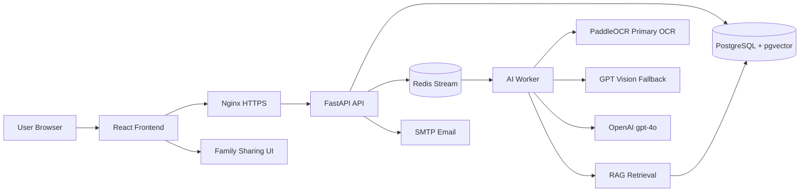

# Health Ladder

Health Ladder는 건강검진 결과와 식단 기록을 바탕으로 건강 위험 신호를 이해하고, AI 상담과 생활습관 챌린지로 연결하는 AI 헬스케어 서비스입니다.

핵심 흐름은 `건강정보 입력/OCR -> 위험 분석 -> AI 설명/RAG 상담 -> 식단 분석 -> 챌린지 추천 -> 가족 공유`입니다. 이 서비스는 의료 진단, 치료, 처방을 제공하지 않으며 건강관리 참고와 생활습관 개선을 돕는 보조 도구입니다.

현재 운영 검증 기준: `v1.1.0`

## Service Overview

Health Ladder는 사용자가 흩어진 건강 데이터를 앱 안에서 연결해 볼 수 있도록 설계되었습니다. 건강검진표를 업로드하면 OCR로 주요 수치를 추출하고, 직접 입력한 건강정보와 함께 위험 신호를 분석합니다. 분석 결과는 AI 설명, RAG 기반 건강상담, 식단 분석, 맞춤 챌린지, 가족 공유 흐름으로 이어집니다.

서비스의 목표는 사용자가 자신의 건강 상태를 더 쉽게 이해하고, 다음 행동으로 이어질 수 있는 작은 생활습관 개선 과제를 제안하는 것입니다.

## Why Health Ladder?

- 건강검진 결과는 어렵고, 식단과 생활습관 기록은 따로 흩어져 있습니다.
- 단순 점수보다 “왜 이런 위험 신호가 보이는지”와 “오늘 무엇을 바꾸면 좋을지”가 중요합니다.
- AI 답변은 의료 판단을 대신하면 안 되므로, 공식 지식 기반과 안전 문구, fallback 정책이 필요합니다.
- 가족 공유와 알림은 혼자 관리하기 어려운 건강관리 루틴을 함께 유지하는 데 도움을 줍니다.

## Core Features

| 기능 | 설명 |
|---|---|
| 건강검진 OCR | 건강검진표 이미지에서 혈압, 혈당, 지질, 간수치, 신장기능 등 주요 항목 후보를 추출합니다. |
| 건강위험 분석 | 입력 건강정보와 검진 수치를 바탕으로 만성질환 위험 신호와 관리 포인트를 안내합니다. |
| AI 건강상담 | `gpt-4o` 기반 상담과 RAG 검색을 결합해 건강관리 참고 답변을 제공합니다. |
| 식단 분석 | 식단 이미지 또는 음식 입력을 바탕으로 음식 후보, 영양 포인트, 질환별 주의사항을 정리합니다. |
| 맞춤 챌린지 | 분석 결과와 생활습관 목표를 챌린지로 연결해 실천 루틴을 만들 수 있게 합니다. |
| 가족 공유 | 가족 구성원과 건강 기록, 알림, 관리 상태를 공유할 수 있는 MVP 흐름을 제공합니다. |

## Architecture



운영 구성은 `React Frontend`, `Nginx`, `FastAPI`, `PostgreSQL + pgvector`, `Redis Stream`, `AI Worker`로 나뉩니다. AI Worker는 OCR, 분석, RAG, 이메일/알림 service job을 처리하며, FastAPI는 API 인증, DB 저장, job enqueue, 조회 흐름을 담당합니다.

## AI Pipeline

운영 검증 기준 `v1.1.0`의 AI 구성은 다음과 같습니다.

- 건강검진 OCR: PaddleOCR primary, GPT Vision fallback
- 식단 Vision: GPT Vision 기반 음식 후보 추출
- 챗봇: `gpt-4o` 기반 AI 건강상담
- RAG: `hybrid_parallel` 검색 전략과 `pgvector` 기반 embedding 검색
- Embedding: OpenAI `text-embedding-3-small`, 1536 dimension
- 식단 추천: `keyword_first_vector_fallback` RAG 전략과 LLM rewrite
- 분석 설명: rule 기반 결과를 우선하고, 설정이 켜진 경우 LLM rewrite로 문장을 보조

RAG ingest/embed는 자동배포에서 자동 실행되지 않습니다. RAG chunks와 embedding 데이터는 PostgreSQL Docker volume에 유지되며, 문서가 바뀌었을 때만 운영자가 별도 절차로 적용합니다.

## Tech Stack

| 영역 | 기술 |
|---|---|
| Frontend | React, TypeScript, Vite |
| Backend | FastAPI, Python 3.13, Tortoise ORM, Aerich |
| Database | PostgreSQL, pgvector |
| Queue | Redis Stream |
| AI/OCR Worker | Python, PaddleOCR, OpenCV, OpenAI Vision |
| LLM/RAG | OpenAI `gpt-4o`, OpenAI Embedding, hybrid/vector RAG |
| Infra | Docker Compose, Nginx, Certbot, GitHub Actions |
| Observability | Langfuse optional |

## Deployment

운영 배포 기준 브랜치는 `main`입니다. `main`에 push되면 GitHub Actions `deploy-prod` workflow가 CI 검증, Docker image build/push, EC2 배포, migration, health check를 순서대로 실행합니다.

운영 인프라:

- EC2
- Docker Compose
- Nginx HTTPS
- DuckDNS 도메인: `healthladder.duckdns.org`
- GitHub Actions `main` 자동배포
- Docker Hub image tag: 수동 검증 `v1.1.0`, 자동배포 `main-<short-sha>`

자세한 운영 절차는 [운영 배포 runbook](docs/deployment/release_deploy_runbook.md)과 [EC2 Docker 배포 가이드](docs/deployment/ec2_docker_deploy_guide.md)를 참고하세요.

## Local Development

팀원이 처음 실행할 때 필요한 최소 명령입니다.

```bash
cp envs/example.local.env .env
make dev-up
make dev-migrate
make dev-seed
make dev-health
```

접속:

- Web: `http://localhost:8080`
- API Docs: `http://localhost:8080/api/docs`
- Health: `http://localhost:8080/api/v1/system/health`

프론트 로컬 개발, rebuild, logs, QA, migration/seed 세부 명령은 [Docker stack 정책](docs/ops/docker_stacks.md)과 [운영 배포 runbook](docs/deployment/release_deploy_runbook.md)을 참고하세요.

## Production Notes

- 실제 운영 env 파일은 EC2 서버의 `.prod.env`에만 존재합니다.
- `.env`, `.prod.env`, API key, SMTP password, DB password, DuckDNS token은 절대 commit하지 않습니다.
- `envs/example.prod.env`는 v1.1.0 운영 검증 기준을 반영한 bootstrap/template입니다.
- GitHub Actions는 `.prod.env` 전체를 덮어쓰지 않고 image version key만 갱신합니다.
- RAG ingest/embed는 자동배포 때 자동 실행되지 않습니다.
- 의료 진단, 치료, 처방 표현은 사용하지 않습니다. 사용자 안내는 건강관리 참고와 의료진 상담 권고 범위에서 유지합니다.

## Version

- 현재 운영 검증 기준: `v1.1.0`
- 운영 자동배포 기준 브랜치: `main`
- 자동배포 image tag: `main-<short-sha>`

## Documentation

- Docker stack 정책: [docs/ops/docker_stacks.md](docs/ops/docker_stacks.md)
- 운영 배포 runbook: [docs/deployment/release_deploy_runbook.md](docs/deployment/release_deploy_runbook.md)
- EC2 Docker 배포 가이드: [docs/deployment/ec2_docker_deploy_guide.md](docs/deployment/ec2_docker_deploy_guide.md)
- 운영 env 가이드: [docs/deployment/ec2_prod_env.md](docs/deployment/ec2_prod_env.md)
- Secret 처리: [docs/ops/secrets_handling.md](docs/ops/secrets_handling.md)
- DB migration 정책: [docs/ops/database_migration_policy.md](docs/ops/database_migration_policy.md)
- RAG embedding runbook: [docs/ops/rag_embedding_runbook.md](docs/ops/rag_embedding_runbook.md)
- Langfuse self-host: [docs/ops/langfuse_self_host.md](docs/ops/langfuse_self_host.md)
- AI Worker / Redis Stream 구조: [docs/design/ai_worker_structure.md](docs/design/ai_worker_structure.md)
- LLM / LangGraph runtime 계획: [docs/design/llm_langgraph_runtime_plan.md](docs/design/llm_langgraph_runtime_plan.md)
- CV food fallback 정책: [docs/design/cv_food_fallback_policy.md](docs/design/cv_food_fallback_policy.md)
- 시연 시나리오: [docs/demo/scenario.md](docs/demo/scenario.md)
- 시연 준비 체크리스트: [docs/demo/ready_checklist.md](docs/demo/ready_checklist.md)
