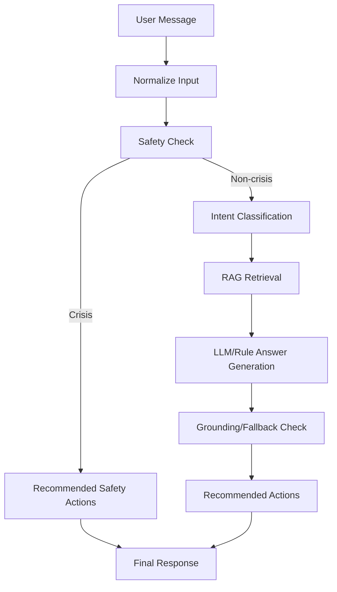

# LLM LangGraph Runtime Plan

이 문서는 `feature/kdu-llm` 기준 LangGraph 기반 LLM 런타임의 현재 구조와 운영 기준을 정리한다. 현재 구현을 확정 상용 구조처럼 과장하지 않고, API contract를 유지하면서 안전 분기, RAG, prompt, trace, 후속 vector 확장 지점을 명확히 두는 데 목적이 있다.

## 1. 목적

LangGraph 런타임은 건강 상담 흐름 전체를 node 단위로 분리해 제어한다. LangChain은 전체 orchestration이 아니라 RAG node 내부의 `Document` 등 필요한 부품으로 제한해서 사용한다.

핵심 책임:

- 건강 상담 입력 정규화
- 정신건강 관련 키워드 safety 분기
- intent 분류
- keyword RAG retrieval
- LLM 또는 rule 기반 답변 생성
- grounding/fallback check
- 챌린지 추천 action 생성
- 최종 API 응답 형식 정리

## 2. 전체 흐름



기본 node 순서:

```text
user input
  -> normalize_input
  -> check_mental_health_safety
  -> classify_intent
  -> retrieve_rag_context
  -> generate_llm_answer
  -> check_grounding_or_fallback
  -> build_recommended_actions
  -> format_final_response
```

위기 키워드가 감지되면 `generate_llm_answer`를 타지 않는다. 대신 `build_recommended_actions`에서 즉시 도움/보호자/전문기관 안내 action을 만들고 `format_final_response`로 이동한다.

## 3. StateGraph State

주요 state 필드:

| 필드 | 역할 |
| --- | --- |
| `user_message` | 사용자 입력. trace에는 원문 전체 대신 sanitized preview만 남긴다. |
| `user_context` | target id, 분석 결과, 위험요인 등 호출부가 넘긴 보조 정보. |
| `intent` | rule/safety 기반 intent. 예: `diabetes_guidance`, `mental_health_crisis_support`. |
| `safety_level` | `crisis`, `professional_support`, `self_care` 또는 `None`. |
| `safety_response` | safety 정책 응답. crisis에서는 LLM rewrite 대상이 아니다. |
| `should_bypass_llm` | LLM generation 우회 여부. crisis에서 `True`. |
| `retrieved_docs` | RAG runtime 내부용 문서 payload. trace에는 본문을 남기지 않는다. |
| `reference_sources` | 프론트/API가 참고 출처로 사용할 source metadata. |
| `reference_summary` | 사용자에게 보여줄 수 있는 짧은 근거 요약. |
| `llm_answer` | LLM 또는 rule/RAG 기반 중간 답변. |
| `final_answer` | safety notice와 grounding guardrail을 반영한 최종 답변. |
| `recommended_actions` | 외부 API contract용 문자열 action 목록. |
| `fallback_reason` | RAG disabled, no result, weak reference, safety fallback 등 fallback 사유. |
| `metadata` | graph run id, node path, node duration 같은 내부 실행 metadata. |
| `trace_metadata` | Langfuse/관측용 축약 metadata. 민감 원문 전체를 저장하지 않는다. |
| `analysis_result`, `analysis_type` | 분석 설명 node 확장용 입력. |
| `risk_factors`, `management_priorities` | 분석 설명과 추천 action에서 활용 가능한 구조화 정보. |

## 4. Node 역할

| Node | 역할 |
| --- | --- |
| `normalize_input` | 입력 문자열 정규화, 기본 state 값 보정, sanitized preview 생성. |
| `check_mental_health_safety` | 정신건강 관련 키워드 분기. crisis면 LLM bypass. |
| `classify_intent` | 일반 건강 질문 intent 분류. safety intent가 있으면 유지. |
| `retrieve_rag_context` | 현재 keyword retriever adapter로 RAG 후보 문서 조회. |
| `generate_llm_answer` | RAG 근거 답변 또는 기존 rule/LLM rewrite 경로 호출. 실제 OpenAI 호출은 flag와 env에 따름. |
| `check_grounding_or_fallback` | 의료 안전 검사, 근거 문서 수, source trust level, reference summary를 보고 보수적 fallback 문구 적용. |
| `build_recommended_actions` | intent, safety level, 분석 위험요인 기반 추천 action 생성. API에는 문자열 목록 유지. |
| `format_final_response` | safety notice를 붙이고 최종 응답 state 정리. |
| `build_analysis_explanation` | 간편/정밀 분석 결과 설명 전용 node. 진단이 아닌 위험요인/관리 우선순위 중심. |

## 5. Conditional Edge

현재 상담 graph의 핵심 conditional edge는 `check_mental_health_safety` 뒤에 있다.

```text
check_mental_health_safety
  -> crisis: build_recommended_actions -> format_final_response
  -> non-crisis: classify_intent -> retrieve_rag_context -> generate_llm_answer
```

Safety bypass 원칙:

- 자해, 극단 선택, 죽고 싶다 등 위기 키워드는 LLM generation/rewrite를 거치지 않는다.
- crisis에서는 챌린지 추천보다 즉시 도움 안내를 우선한다.
- 보호자/주변 사람 연결, 119/112, 전문기관 상담 안내가 일반 건강관리 action보다 앞선다.
- 일반 스트레스/불안/수면 문제는 과잉 crisis 분류하지 않고 자기관리 챌린지 추천을 허용한다.
- 우울/무기력/번아웃 표현은 자기관리와 전문 상담 권고를 함께 제시한다.

## 6. RAG Retrieval

현재 RAG는 keyword retriever adapter를 사용한다.

```text
retrieve_rag_context
  -> get_default_rag_retriever()
  -> KeywordRagRetriever.retrieve()
  -> docs/rag_sources/index.json + markdown source
  -> retrieved_docs, reference_sources, reference_summary
```

현재 유지하는 contract:

- `retrieved_docs`: runtime 내부 context payload
- `reference_sources`: API/프론트에 전달 가능한 source metadata
- `reference_summary`: 참고 문서 요약
- `trace_metadata.retrieval`: document id, source type, trust level, score 등. 본문은 제외

후속 확장 지점:

- embedding model
- vector store
- pgvector
- similarity score
- source review status
- source trust level 고도화

Vector retriever를 붙일 때도 `RagRetriever` interface와 `RagRetrievalResult` shape를 유지하면 graph node 변경을 줄일 수 있다.

## 7. Source Trust Level과 Grounding

RAG source는 trust level로 분류한다.

| Trust level | 의미 |
| --- | --- |
| `official_guideline` | 임상/영양 공식 가이드라인 후보 |
| `public_health_agency` | 공공기관, 학회, 공공데이터 source |
| `internal_policy` | 서비스 안전/면책/내부 정책 문서 |
| `service_faq` | 서비스 FAQ |
| `challenge_policy` | 챌린지 정책 문서 |
| `unknown` | 신뢰도 판단 불가 source |

`check_grounding_or_fallback`는 아래를 확인한다.

- retrieved document count
- reference source count
- source trust levels
- reference summary 존재 여부
- medical safety check 결과
- fallback reason

Grounding 정책:

- 근거 문서가 없으면 “근거 문서를 찾지 못했습니다” 안내를 붙이고 일반 참고 수준으로 낮춘다.
- source trust level이 낮으면 “근거 수준이 제한적” 안내를 붙여 단정성을 낮춘다.
- 의료 진단/처방처럼 보이는 표현은 safety check/fallback 대상으로 본다.
- crisis safety response는 RAG grounding보다 우선한다.

## 8. Prompt Version 관리

Prompt는 version 단위로 관리한다.

예시:

- `health_chat_v1`
- `rag_grounded_answer_v1`
- `analysis_explanation_v1`
- `challenge_recommendation_v1`
- `fallback_safe_response_v1`

운영 기준:

- prompt version은 generation metadata와 trace metadata에 남길 수 있어야 한다.
- safety crisis 응답은 LLM prompt rewrite를 타지 않는다.
- 분석 결과 설명 prompt는 확정 진단이 아니라 위험요인 참고/관리 우선순위 안내로 제한한다.
- fallback prompt는 진단/처방 표현을 포함하지 않는다.

## 9. Langfuse Trace Metadata

Langfuse는 실제 서버 호출 여부와 무관하게 trace metadata 구조를 유지한다. `LANGFUSE_ENABLED=false`에서는 no-op으로 통과해야 한다.

기록 가능한 metadata:

- `graph_run_id`
- `node_path`
- `node_duration_ms`
- `intent`
- `safety_level`
- `should_bypass_llm`
- `fallback_reason`
- `prompt_version`
- `model_name`
- `source`
- retrieved document ids
- reference source types
- source trust levels
- grounding status
- recommended action types

민감정보 원칙:

- 전체 user message를 그대로 남기지 않는다.
- sanitized preview와 message length 중심으로 남긴다.
- 이메일, 전화번호, 주민등록번호 형태, API key/token/password 형태 문자열은 masking한다.
- RAG 문서 본문 전체를 trace에 남기지 않는다.
- 건강검진 원문이나 민감 건강정보 원문 전체를 trace metadata에 남기지 않는다.

## 10. API Contract

챗봇 API 응답 contract는 기존 프론트 흐름을 깨지 않도록 유지한다.

주요 응답 필드:

- `answer`
- `source`
- `context_type`
- `recommended_actions`
- `safety_notice`

`recommended_actions`는 내부적으로 구조화 action metadata를 만들더라도, 외부 API에는 기존처럼 문자열 목록으로 반환한다. 구조화 정보는 trace metadata나 후속 내부 확장 지점으로 둔다.

## 11. 의료 안전 정책

LLM/RAG 응답은 의료 판단을 대신하지 않는다.

표현 원칙:

- “진단합니다”, “치료하세요”, “약을 바꾸세요” 같은 표현 금지
- “가능성이 있습니다”, “관리 참고용입니다”, “전문가 상담을 권장합니다” 중심
- 분석 결과는 확정 진단이 아니라 위험요인/관리 우선순위 안내
- 식단/챌린지 추천은 질병 치료가 아니라 생활습관 개선 참고
- 정신건강 위기 키워드는 일반 챌린지 추천보다 안전 안내 우선

## 12. 후속 작업

후속 vector/RAG 작업:

- 신뢰 가능한 source registry 정비
- 문서 chunking 정책
- embedding model 선택
- pgvector schema 설계
- similarity score threshold
- source trust level/review status 운영 정책
- RAG 평가 dataset과 hallucination 의심률 측정

후속 LLM 운영 작업:

- prompt registry 운영 정책
- prompt version별 회귀 테스트
- Langfuse trace review workflow
- safety keyword review
- analysis explanation과 challenge recommendation의 A/B 평가
- 민감정보 masking 정책 확대
